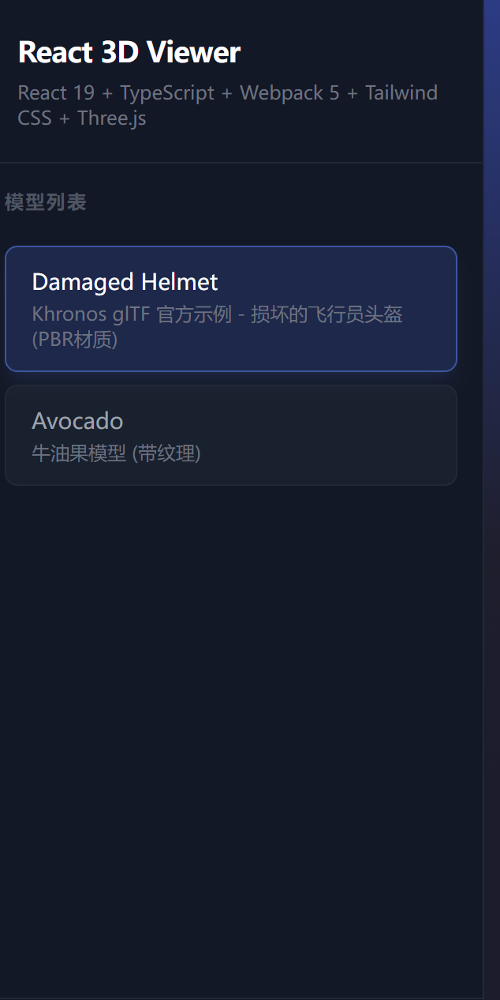

```
创建一个基于最新版本react和最佳的react生态系统的示例项目，需要支持ts和tsx，构建工具使用webpack5,css框架使用tailwind
  css，项目里同时里面需要包含一个模块展示gltf格式三维模型预览功能,基于three.js
```

```
哪个命令可以将我输入的内容加入CLAUDE.md
```

```
为了代码文件格式更加规范，请引入eslint及prettier
```

```

这部分有点丑，能不能美化一下使他们更美观并且适当增加动画效果
```
